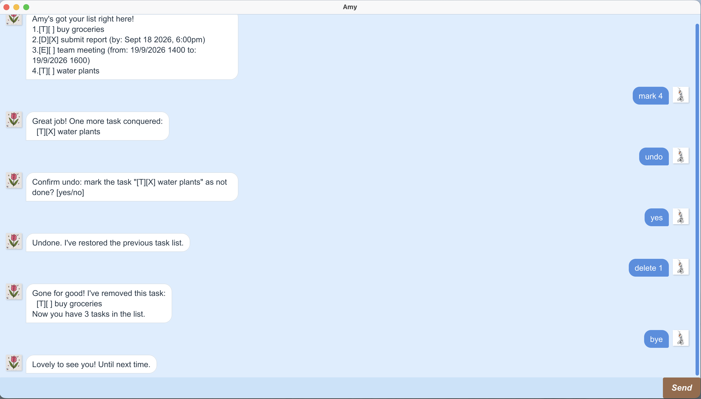

# Amy User Guide

Amy is a friendly task-management chatbot with both a command-line interface
and a JavaFX graphical interface. It helps you create, organize, search, and
update todos, deadlines, and events.



## Quick start

1. Install JDK 25.
2. Open the project in IntelliJ IDEA or run Amy using Gradle.
3. Enter commands in the console or GUI input box and press Enter or **Send**.
4. Start with `list` to view your tasks.

Example session:

```text
todo buy groceries
list
mark 1
bye
```

## Features

### Adding a todo: `todo`

Adds a regular task to the list.

Format: `todo DESCRIPTION`

Example: `todo buy groceries`

### Adding a deadline: `deadline`

Adds a task with a due date and time.

Format: `deadline DESCRIPTION /by DATE_TIME`

The date and time use `d/M/yyyy HHmm`, such as `18/9/2026 1800`.

Example: `deadline submit report /by 18/9/2026 1800`

### Adding an event: `event`

Adds an event with a start and end time.

Format: `event DESCRIPTION /from START /to END`

Example: `event team meeting /from 19/9/2026 1400 /to 19/9/2026 1600`

### Listing tasks: `list`

Displays every task, its type, completion status, and any deadline or event
details.

Format: `list`

### Marking a task complete: `mark`

Marks the task at the specified list number as complete.

Format: `mark TASK_NUMBER`

Example: `mark 1`

### Marking a task incomplete: `unmark`

Marks a completed task as incomplete.

Format: `unmark TASK_NUMBER`

Example: `unmark 1`

### Finding tasks: `find`

Searches task descriptions using a case-insensitive keyword.

Format: `find KEYWORD`

Example: `find report`

### Deleting a task: `delete`

Removes the task at the specified list number.

Format: `delete TASK_NUMBER`

Example: `delete 2`

### Undoing a command: `undo`

Undoes the most recent successful task-changing command. Amy asks for
confirmation before changing the task list. Reply with `y` or `yes` to confirm,
or `n` or `no` to cancel. Undo history is kept for the current session only.

Format: `undo`, followed by `yes` or `no`

Example:

```text
undo
Confirm undo: remove the task "[T][ ] buy milk"? [yes/no]
yes
Undone. I've restored the previous task list.
```

### Switching themes: `dark mode` and `light mode`

Changes the GUI between dark and light themes. Theme changes apply to the
current session only.

Formats: `dark mode` or `light mode`

### Exiting Amy: `bye`

Closes the current Amy session.

Format: `bye`

## Saving and loading data

Amy automatically saves task changes in `~/.amy/amy.txt`. The console and GUI
use the same data file. If the file does not exist, Amy starts with an empty
list. Corrupted records are skipped so that valid tasks can still be loaded.

## Error handling

Amy responds with a helpful message when a command is unknown, a required
argument is missing, a task number is invalid, a date is malformed, or an undo
confirmation is not understood. If the GUI cannot be loaded, Amy displays a
startup error dialog asking the user to try again.

## Command summary

| Action | Format |
| --- | --- |
| Add todo | `todo DESCRIPTION` |
| Add deadline | `deadline DESCRIPTION /by DATE_TIME` |
| Add event | `event DESCRIPTION /from START /to END` |
| List tasks | `list` |
| Mark complete | `mark TASK_NUMBER` |
| Mark incomplete | `unmark TASK_NUMBER` |
| Find tasks | `find KEYWORD` |
| Delete task | `delete TASK_NUMBER` |
| Undo change | `undo`, then `yes` or `no` |
| Dark theme | `dark mode` |
| Light theme | `light mode` |
| Exit | `bye` |
